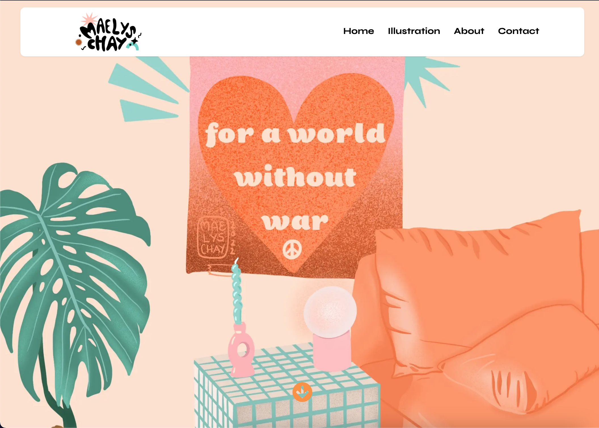
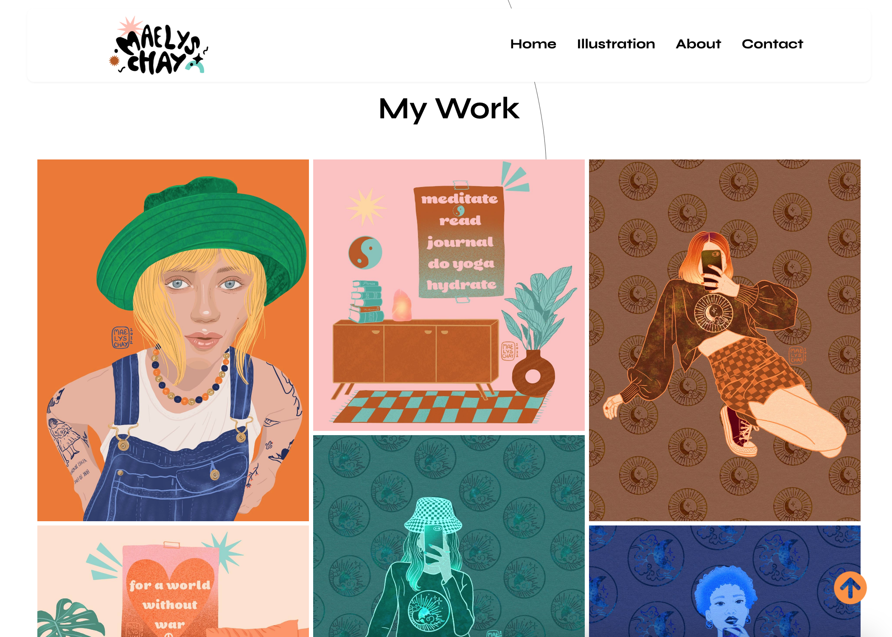

## Maëlys Chay - Illustration Portfolio



## Features

- Typescript Front End.
- Headless CMS that allows the client to edit every part of the text and images.
- Custom schemas written for the content management.
- Server Side Rendering.
- Mobile first responsive design.
- Custom SVG's created using Figma.
- Page & SVG animations using Framer Motion.
- Serverless API functions to handle mail requests.



## Getting Started

Clone this repo and move into the project directory.

```
$ git clone https://github.com/philsmithies/maelys_portfolio.git
$ cd maelys_portfolio
$ yarn
$ yarn dev
```

To run the development server:

```bash
npm run dev
# or
yarn dev
```

Open [http://localhost:3000](http://localhost:3000) with your browser to see the result.

You can start editing the page by modifying `pages/index.js`. The page auto-updates as you edit the file.
